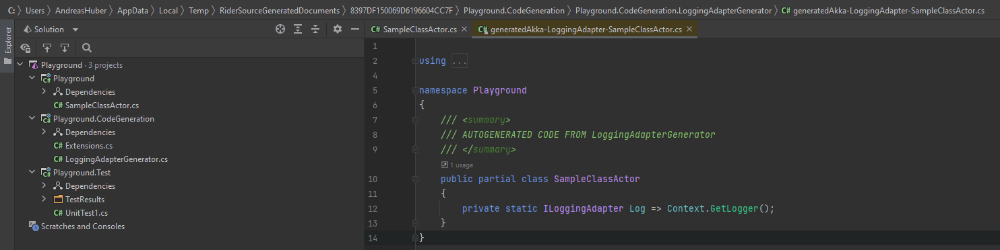

# Reproduce Coverlet Issue #1262
## 0% coverage of library when using source generator #1262
https://github.com/coverlet-coverage/coverlet/issues/1262

Run the code coverage, and the resulting coverage.cobertura.xml file will be empty.
`dotnet test -c Release --collect:"XPlat Code Coverage"`

To show it is working without the generators, remove the following line from Playground.csproj. IDE might need a restart for it to work.
``` xml
<ProjectReference Include="..\Playground.CodeGeneration\Playground.CodeGeneration.csproj" OutputItemType="Analyzer" ReferenceOutputAssembly="false" />
```

The code that is generated has no influence when it is added without the generator.
